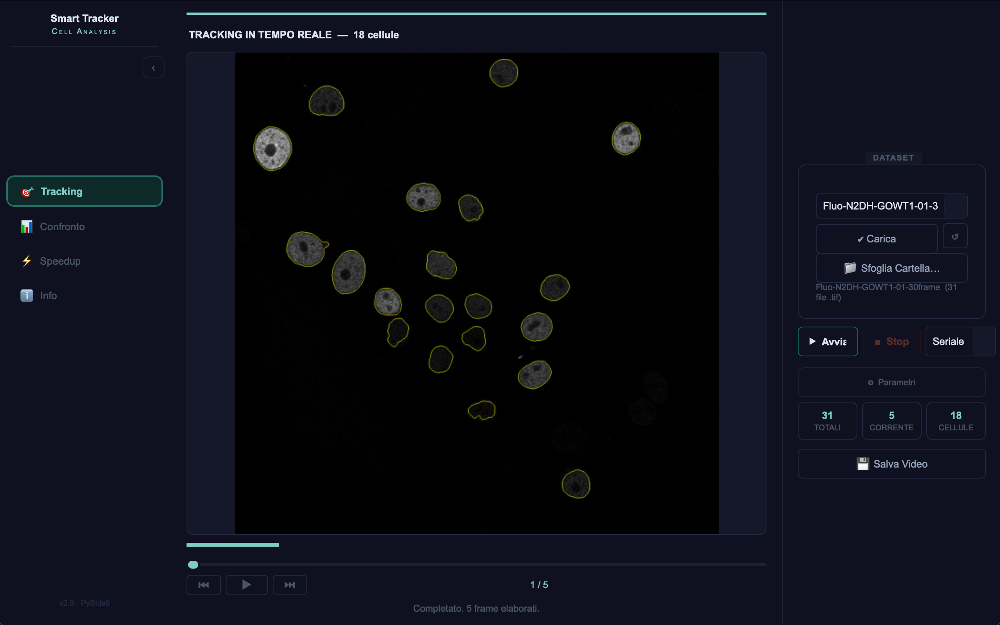
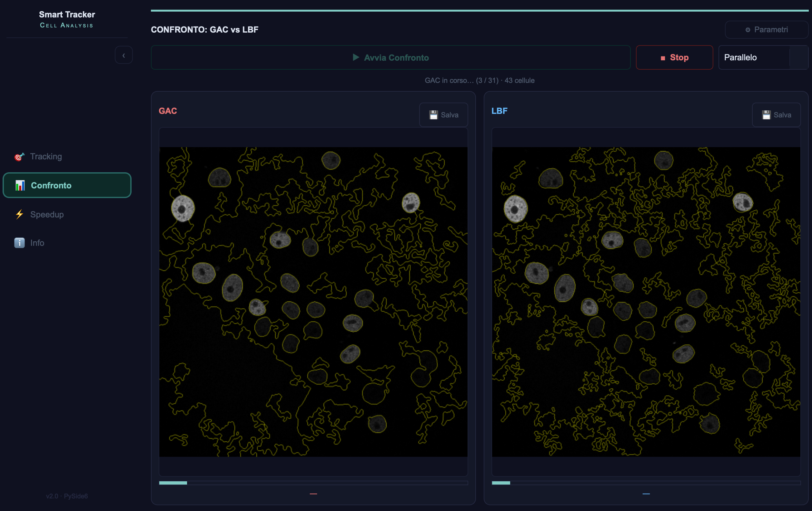
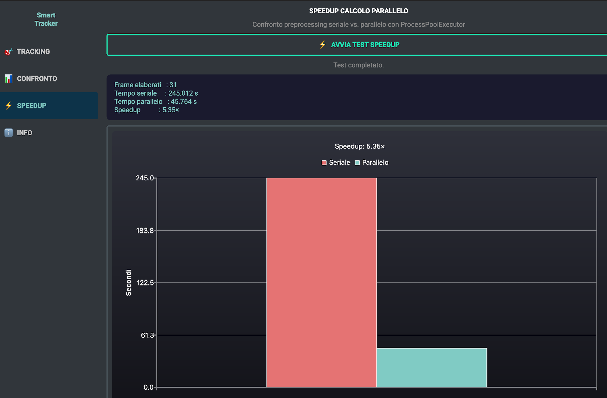
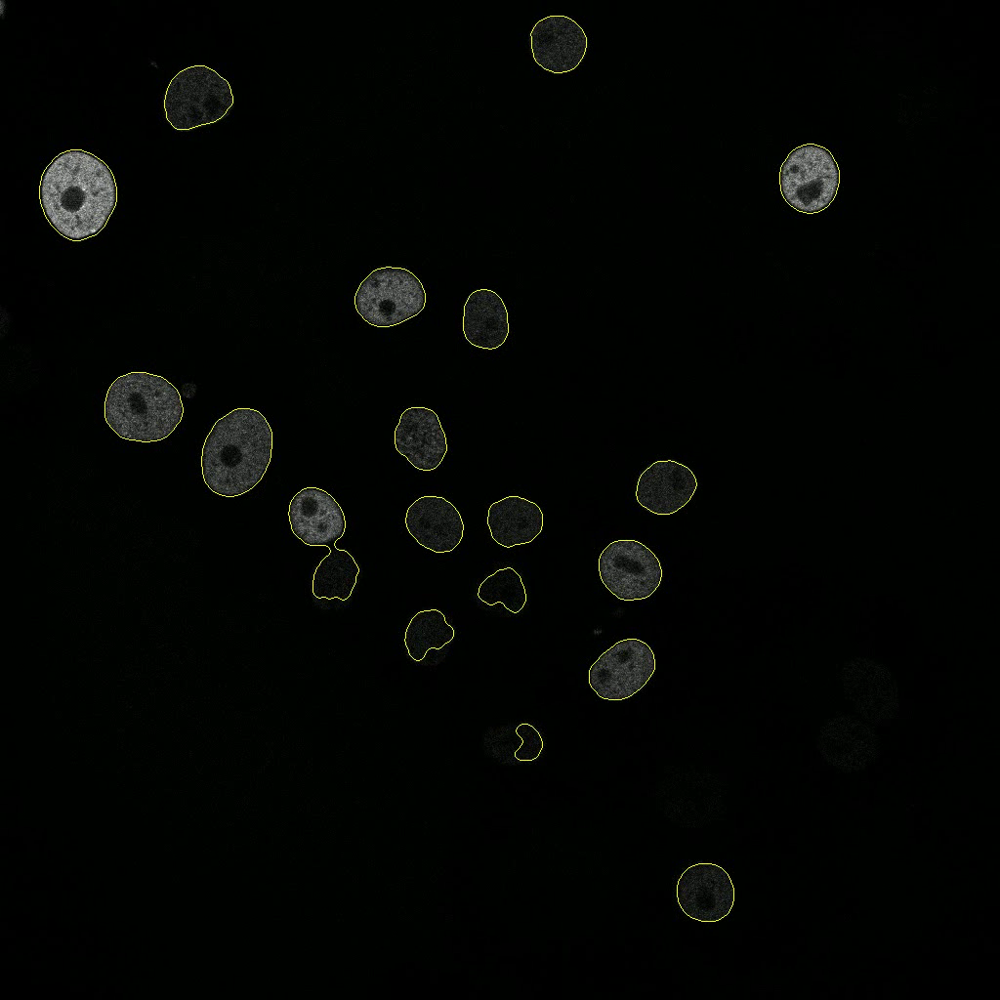

# Parallel Smart Tracker

> 🇮🇹 [Italiano](#italiano) · 🇬🇧 [English](#english)

---

## Italiano

Applicazione desktop per il tracking automatico di cellule in video di microscopia, che combina algoritmi di segmentazione Level Set con calcolo parallelo per un'analisi rapida e accurata.

Realizzato con **PySide6** · **scikit-image** · **OpenCV** · **PyInstaller**

---

### Screenshot

| Tracking | Confronto GAC vs LBF |
|:---:|:---:|
|  |  |

| Speedup parallelo | Output Chan-Vese |
|:---:|:---:|
|  |  |

---

### Come funziona

Il tracciamento manuale di cellule in video time-lapse può richiedere ore di lavoro per pochi minuti di filmato. Smart Tracker automatizza il processo:

1. Carica una cartella di frame `.tif` (o qualsiasi formato immagine standard)
2. Pre-elabora ogni frame (filtro mediano → Top-Hat → CLAHE)
3. Segmenta le cellule con un algoritmo Level Set (Chan-Vese di default)
4. Usa il risultato di ogni frame come punto di partenza per il successivo — il contorno "segue" la cellula nel tempo
5. Elabora tutti i frame in parallelo sfruttando tutti i core della CPU disponibili

Il risultato è una maschera binaria per ogni frame che indica esattamente dove si trova la cellula.

---

### Algoritmi

#### Chan-Vese (default)
Level Set basato su regioni che minimizza la differenza tra l'intensità dei pixel e la media dentro/fuori il contorno. Non richiede bordi netti — ideale per cellule sfocate o a basso contrasto.

#### GAC (Geodesic Active Contours)
Level Set basato sui bordi che segue i gradienti di intensità. Più veloce ma richiede contorni più definiti.

#### LBF (Local Binary Fitting)
Modello regionale adattivo locale. Gestisce cellule con intensità interna non uniforme (es. nucleo visibile) ma è il più lento dei tre.

| | GAC | Chan-Vese | LBF |
|---|---|---|---|
| Tipo | Edge-based | Region globale | Region locale |
| Cellule sfocate | ✗ | ✓ | ✓ |
| Velocità (100 frame) | ~12 s | ~24 s | ~82 s |
| Accuratezza | Bassa | Alta | Alta |

**Chan-Vese + pre-elaborazione CLAHE è la configurazione consigliata** per dati tipici di microscopia a fluorescenza.

---

### Funzionalità

| Scheda | Descrizione |
|--------|-------------|
| **Tracking** | Anteprima live frame per frame con overlay. Parametri configurabili: iterazioni, smoothing, lambda. Modalità seriale o parallela. |
| **Confronto** | Confronto affiancato di GAC vs LBF sullo stesso dataset, con pannelli parametri indipendenti e grafico speedup. |
| **Speedup** | Benchmark seriale vs parallelo con grafico dei tempi per numero di core. |
| **Info** | Documentazione degli algoritmi e guida all'uso. |

La sidebar è collassabile. Tutti i pannelli parametri sono collassabili.

---

### Installazione (sviluppo locale)

```bash
# 1. Clona la repo
git clone https://github.com/massimomarrone/parallel-smart-tracker.git
cd parallel-smart-tracker

# 2. Crea un ambiente virtuale pulito
python3.11 -m venv venv
source venv/bin/activate          # Windows: venv\Scripts\activate

# 3. Installa le dipendenze
pip install PySide6 numpy tifffile scipy scikit-image opencv-python
```

```bash
# Avvia l'applicazione
python smart_tracker_pyside6.py
```

---

### Build applicazione standalone

#### macOS (.app)
```bash
pip install pyinstaller
pyinstaller smart_tracker.spec --clean
# Output: dist/Smart Tracker.app
```

#### Windows (.exe)
```bash
pip install pyinstaller
pyinstaller smart_tracker_win.spec --clean
# Output: dist/SmartTracker/SmartTracker.exe
```

> **Consiglio:** esegui sempre il build in un ambiente virtuale pulito (non Anaconda) per mantenere il bundle leggero (~300 MB invece di 1+ GB).

---

### CI/CD — GitHub Actions

Ad ogni push su `main` vengono compilate automaticamente entrambe le piattaforme in parallelo:

- `build-macos` → `Smart_Tracker_macOS.zip` (contiene `Smart Tracker.app`)
- `build-windows` → cartella `SmartTracker/` (portabile, senza installer)

Scarica gli artefatti dalla scheda **Actions** di questa repository al termine di ogni build.

> Il virtual environment **non** è incluso nella repo. GitHub Actions installa tutte le dipendenze da zero su ogni runner tramite `pip install`.

---

### Struttura del progetto

```
.
├── smart_tracker_pyside6.py      # Applicazione principale (UI PySide6 + algoritmi)
├── smart_tracker.spec            # Spec PyInstaller — macOS
├── smart_tracker_win.spec        # Spec PyInstaller — Windows
└── .github/
    └── workflows/
        └── build.yml             # CI build per macOS + Windows
```

---

### Stack tecnologico

- **PySide6** — framework UI Qt6
- **scikit-image** — implementazioni Level Set Chan-Vese e GAC
- **OpenCV** — pre-elaborazione immagini (filtro mediano, morfologia Top-Hat, CLAHE)
- **SciPy** — utilità signal e ndimage
- **tifffile** — caricamento TIFF multi-frame
- **concurrent.futures** — `ProcessPoolExecutor` per l'elaborazione parallela dei frame
- **PyInstaller** — packaging standalone per macOS e Windows

---

### Autore

**Massimo Marrone** — Progetto di Calcolo Scientifico

---

---

## English

A desktop application for automated cell tracking in microscopy videos, combining Level Set segmentation algorithms with parallel computing for fast, accurate analysis.

Built with **PySide6** · **scikit-image** · **OpenCV** · **PyInstaller**

---

### Screenshots

| Tracking | Comparison GAC vs LBF |
|:---:|:---:|
|  |  |

| Parallel Speedup | Chan-Vese Output |
|:---:|:---:|
|  |  |

---

### What it does

Biologists manually tracing cells in time-lapse microscopy videos can spend hours on just a few minutes of footage. Smart Tracker automates this:

1. Loads a folder of `.tif` frames (or any standard image format)
2. Preprocesses each frame (median filter → Top-Hat → CLAHE)
3. Segments cells using a Level Set algorithm (Chan-Vese by default)
4. Uses each frame's result as the seed for the next — so the contour "follows" the cell through time
5. Runs all frames in parallel across every available CPU core

The result is a clean binary mask per frame, showing exactly where each cell is.

---

### Algorithms

#### Chan-Vese (default)
Region-based Level Set that minimises the difference between pixel intensity and the mean inside/outside the contour. No sharp edges required — ideal for blurry or low-contrast cells.

#### GAC (Geodesic Active Contours)
Edge-based Level Set that follows intensity gradients. Faster but needs cleaner borders.

#### LBF (Local Binary Fitting)
Locally adaptive region model. Handles cells with uneven internal intensity (e.g. visible nucleus) but is the slowest of the three.

| | GAC | Chan-Vese | LBF |
|---|---|---|---|
| Type | Edge-based | Region global | Region local |
| Works on blurry cells | ✗ | ✓ | ✓ |
| Speed (100 frames) | ~12 s | ~24 s | ~82 s |
| Accuracy | Low | High | High |

**Chan-Vese + CLAHE preprocessing is the recommended configuration** for typical fluorescence microscopy data.

---

### Features

| Tab | Description |
|-----|-------------|
| **Tracking** | Frame-by-frame live preview with overlay. Configurable iterations, smoothing, and lambda parameters. Serial or parallel mode. |
| **Confronto** | Side-by-side comparison of GAC vs LBF on the same dataset, with independent parameter panels and a speedup chart. |
| **Speedup** | Benchmark serial vs parallel processing and plot the wall-clock time per core count. |
| **Info** | Algorithm documentation and usage guide. |

The sidebar is collapsible. All parameter panels are also collapsible.

---

### Installation (local development)

```bash
# 1. Clone
git clone https://github.com/massimomarrone/parallel-smart-tracker.git
cd parallel-smart-tracker

# 2. Create a clean virtual environment
python3.11 -m venv venv
source venv/bin/activate          # Windows: venv\Scripts\activate

# 3. Install dependencies
pip install PySide6 numpy tifffile scipy scikit-image opencv-python
```

```bash
# Run
python smart_tracker_pyside6.py
```

---

### Building a standalone app

#### macOS (.app)
```bash
pip install pyinstaller
pyinstaller smart_tracker.spec --clean
# Output: dist/Smart Tracker.app
```

#### Windows (.exe)
```bash
pip install pyinstaller
pyinstaller smart_tracker_win.spec --clean
# Output: dist/SmartTracker/SmartTracker.exe
```

> **Tip:** always build inside a clean virtual environment (not Anaconda) to keep the bundle small (~300 MB vs 1+ GB).

---

### CI/CD — GitHub Actions

Every push to `main` automatically builds both platforms in parallel:

- `build-macos` → `Smart_Tracker_macOS.zip` (contains `Smart Tracker.app`)
- `build-windows` → `SmartTracker/` folder (portable, no installer needed)

Download the artifacts from the **Actions** tab of this repository after each build completes.

> The virtual environment is **not** committed to the repo. GitHub Actions installs all dependencies fresh on each runner via `pip install`.

---

### Project structure

```
.
├── smart_tracker_pyside6.py      # Main application (PySide6 UI + algorithms)
├── smart_tracker.spec            # PyInstaller spec — macOS
├── smart_tracker_win.spec        # PyInstaller spec — Windows
└── .github/
    └── workflows/
        └── build.yml             # CI build for macOS + Windows
```

---

### Tech stack

- **PySide6** — Qt6 UI framework
- **scikit-image** — Chan-Vese and GAC Level Set implementations
- **OpenCV** — image preprocessing (median filter, Top-Hat morphology, CLAHE)
- **SciPy** — signal and ndimage utilities
- **tifffile** — multi-frame TIFF loading
- **concurrent.futures** — `ProcessPoolExecutor` for parallel frame processing
- **PyInstaller** — standalone packaging for macOS and Windows

---

### Author

**Massimo Marrone** — Calcolo Scientifico project
